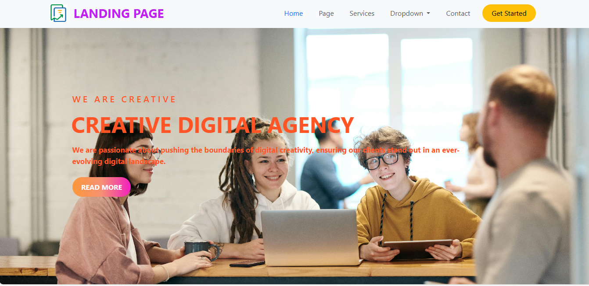

# Landing Page

A landing page built using HTML and CSS. This project was developed as part of my internship at CodeSoft.

## Key Features

- **Clean Layout**: A modern and clean layout to showcase content effectively.
- **Hero Section**: An attractive hero section with a headline and call-to-action button.
- **Services Section**: A section to highlight the services or features.
- **Dropdown Menu**: A functional dropdown menu for easy navigation.
- **Contact Section**: A simple contact form for users to get in touch.

## Screenshots

### Screenshot-01

### Screenshot-02

### Screenshot-03

## Technologies Used

- **HTML**: For the structure of the landing page.
- **CSS**: For styling and layout.
